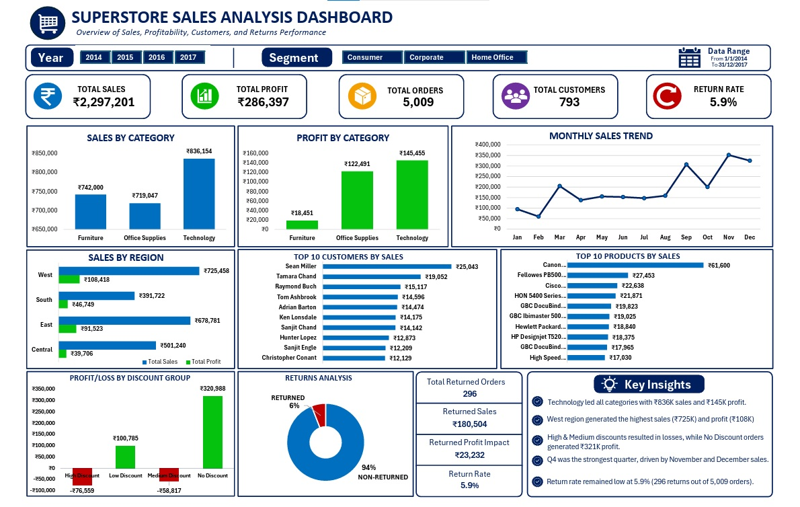

# Sales Dashboard using Excel

## Project Overview

This project analyzes sales performance across different departments, regions, and months using Excel.

## Tools Used

- Microsoft Excel
- Pivot Tables
- Power Query
- Power Pivot

## Key Performance Indicators

- Total Sales
- Total Orders
- Total Profit

## Dashboard Features

- Interactive Dashboard
- KPI Cards
- Charts
- Filters
- Data Analysis

## Dashboard Preview

## Key Insights

- Identified top-performing departments.
- Analyzed sales trends across time.
- Compared performance across regions.

## Files Included

- Sales_Dashboard.xlsx
- Project_Report.pdf
- Dashboard.png
